# Music Genre Classification

## Abstract

This paper showcases our experience with building a Music Genre Classifier. Our main aim was to create a machine learning model to classify between different genres of music. We used the GTZAN Genre Collection dataset. We processed the dataset to be useful in classification models. We used multiple classification models using different algorithms and compared their results.

## Music Genre Classification

### INTRODUCTION

Music can be classified into multiple genres of music. The genre of music can be identified by defining a generalized set of criteria with respect to each genre of music. This generalized criteria can be obtained by using certain features that an audio file bears. Features like tempo, beats, chroma values, spectral values.

### Dataset

The GTZAN genre collection dataset was collected in 2000-2001. It consists of 1000 audio files each having 30 seconds duration. There are 10 classes (10 music genres) each containing 100 audio tracks. Each track is in .wav format. It contains audio files of the following 10 genres:

- Blues
- Classical 
- Country
- Disco
- Hiphop
- Jazz
- Metal
- Pop
- Reggae
- Rock

### METHODOLOGY

#### Overview

We will be testing out the following classification models for the task:

- Naïve Bayes Classifier
- Stochastic Gradient Descent Classifier 
- K-Nearest Neighbors Classifier
- Decision Tree Classifier
- Random Forest Classifier
- Logistic Regression
- Multi-Layer Perceptron Classifier
- Support Vector Machine
- XGBoost Classifier
- Convolutional Neural Network (CNN)

#### Dataset pre-processing and Visualization:

Firstly the dataset was imported and segregated into a dictionary of audio files with key as the genre with the help of librosa library and then the audio files were visualized.

  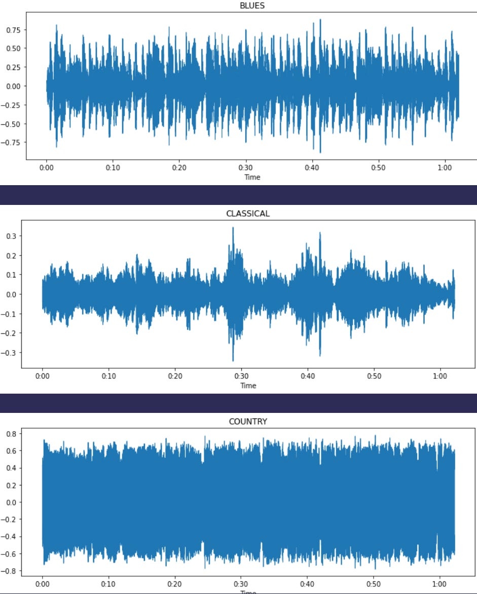

(Other Genres were visualized similarly)

Then Spectrograms were plotted Firstly Normal Spectrograms then Mel Spectrograms

**A Few Normal Spectrograms**

  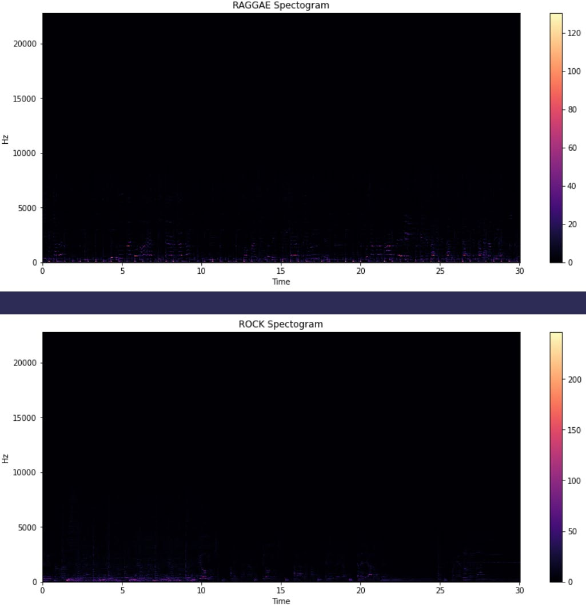

**A Few Mel Spectrograms:** 

  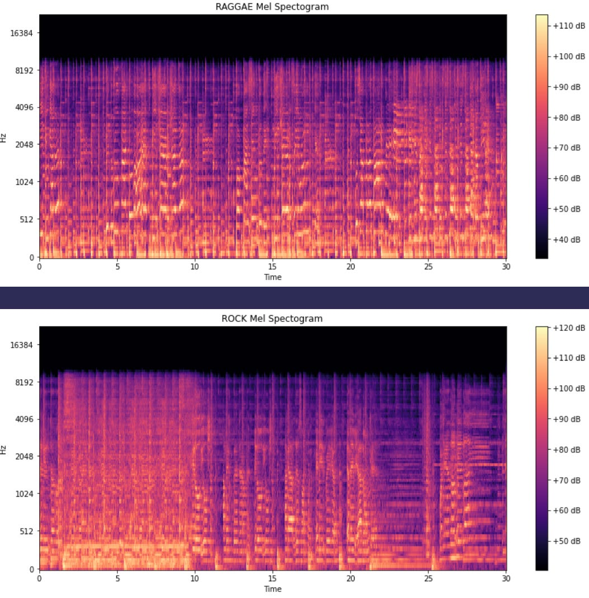

**Chroma Feature plots**

  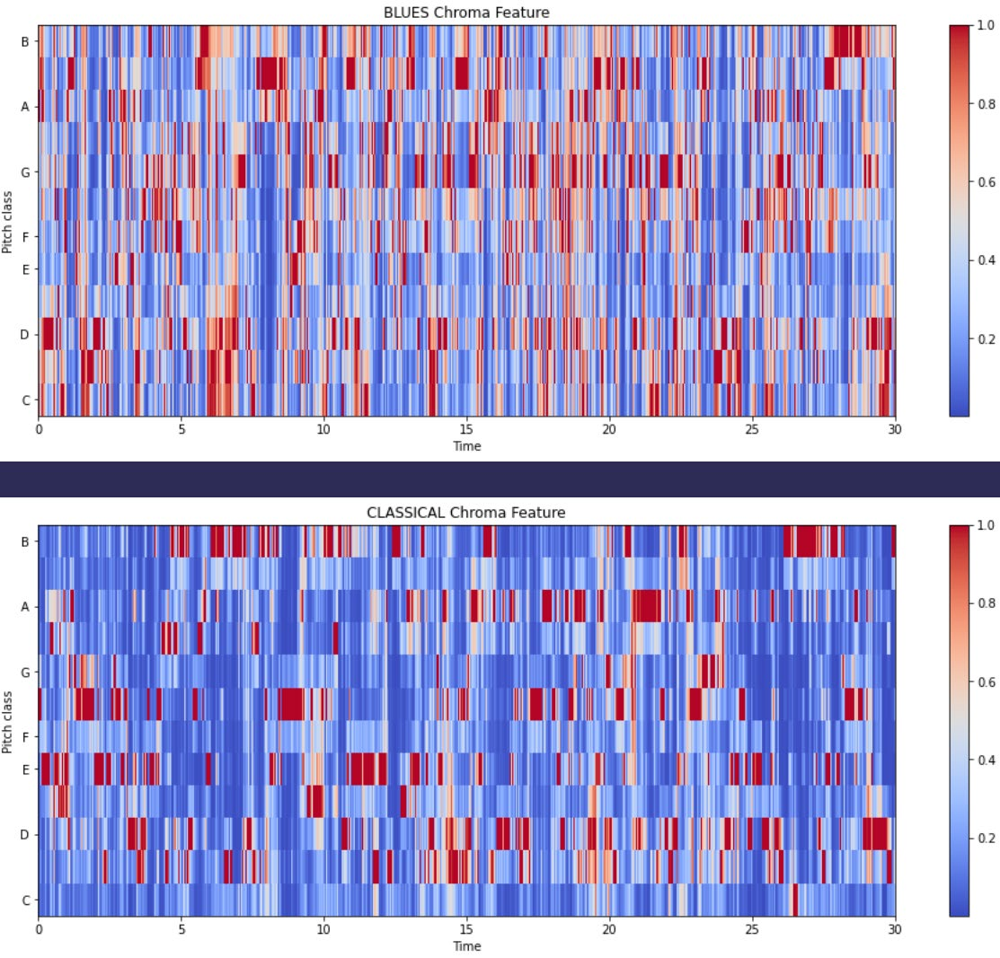

**Plots with Zero-Crossing Rates**

  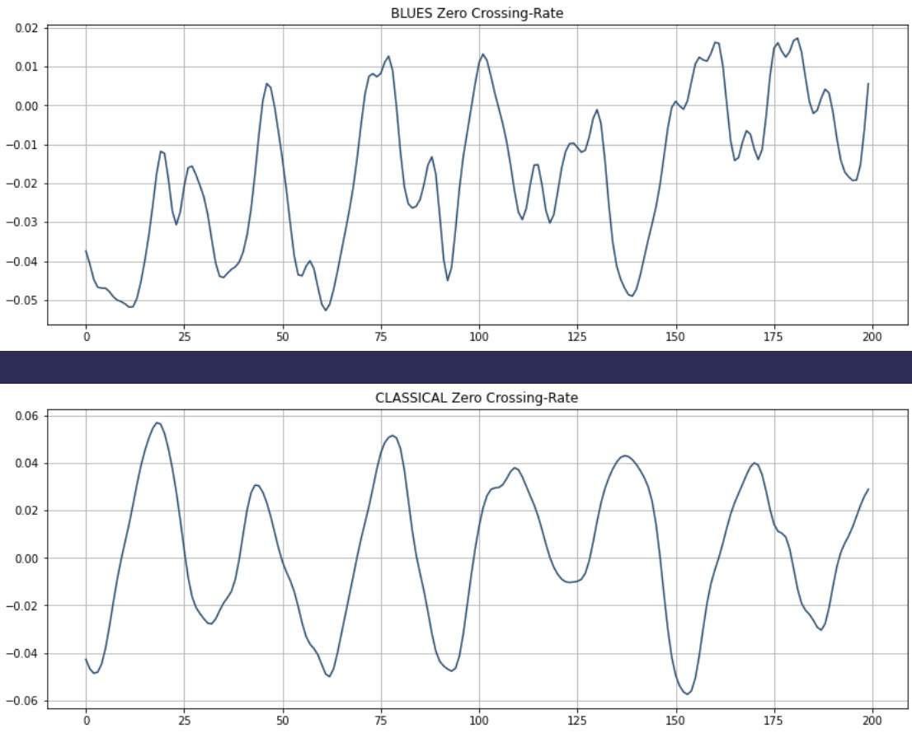

**Plots with MFCC(mel-frequency cepstral coefficients):**

  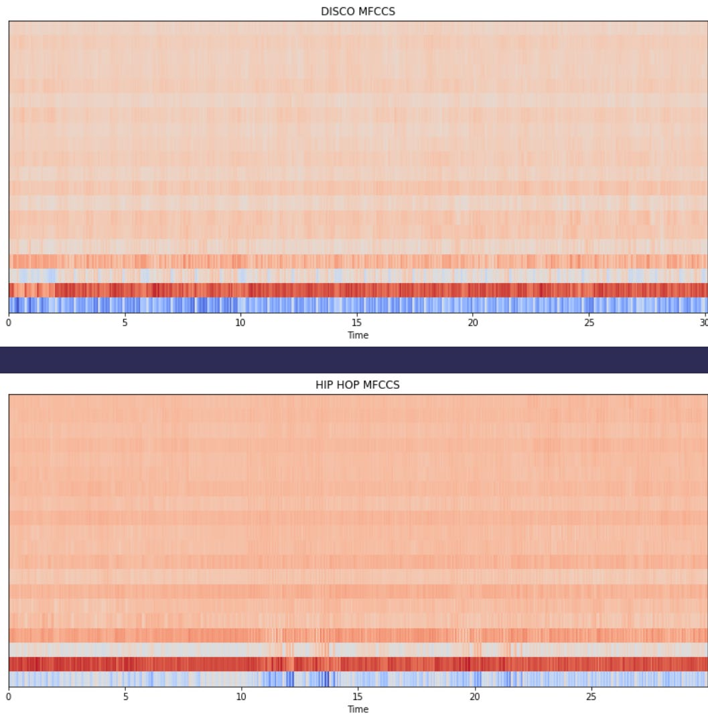

Spectral centroid values and Spectral Rolloff values were extracted from the data.

**Correlation Heatmap**

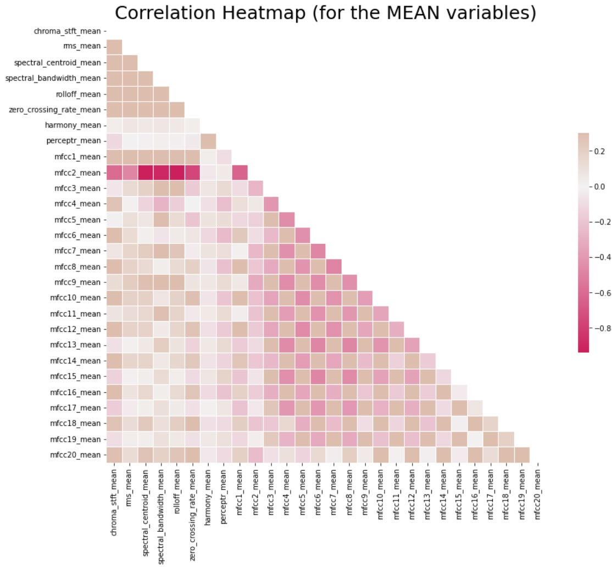

**Principle Component Analysis(PCA)**

For Dimensionality Reduction PCA was done on the data set to produce the following output

  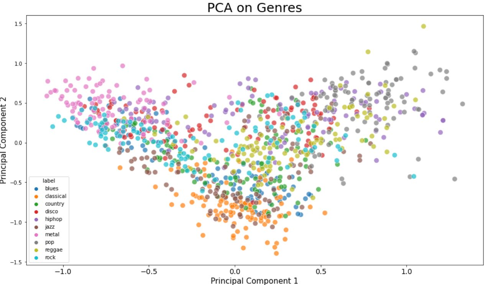
  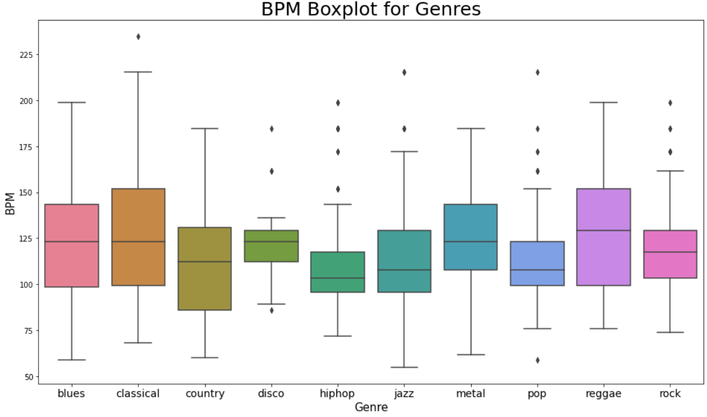

The Dataset was then normalized and put into train test split.

#### Implementation of Classification Models

- **Naïve Bayes Classifier (Gaussian):** It is used in classification and it assumes that features follow a normal distribution. It assumes that every pair of features being classified is independent of each other.
 - The model was declared with parameters with default values

- **Stochastic Gradient Descent Classifier:** It is used for discriminative learning of linear classifiers under convex loss functions. This estimator implements regularized linear models with stochastic gradient descent (SGD) learning.
 - The model was declared with parameters with default values except max_iter=5000

- **K-Nearest Neighbors Classifier:** The K-Nearest Neighbors algorithm, also known as is a non-parametric, supervised learning classifier, which uses proximity to make classifications or predictions about the grouping of an individual data point. 
 - The model was declared with n_neighbors=10

- **Decision Tree Classifier:** The decision tree classifier creates the classification model by building a decision tree. Each node in the tree specifies a test on an attribute, each branch descending from that node corresponds to one of the possible values for that attribute.
 - The model was declared with default parameters

- **Random Forest Classifier:** A random forest is a meta estimator that fits a number of decision tree classifiers on various sub-samples of the dataset and uses averaging to improve the predictive accuracy and control over-fitting.
 - The model was declared with n_estimators=1000 & max_depth=10

- **Logistic Regression:** This model takes a linear equation as input and use logistic function and log odds to perform a binary classification task.
 - The model was declared with solver='lbfgs', multi_class='multinomial'

- **Multi-Layer Perceptron Classifier:** It implements a multi-layer perceptron (MLP) algorithm that trains using Backpropagation. Multi-layer Perceptron (MLP) is a supervised learning algorithm that learns a function by training on a dataset, where is the number of dimensions for input and is the number of dimensions for output.
 - The model was declared solver='lbfgs', alpha=1e-5, hidden_layer_sizes=(5000,10)

- **Support Vector Machine:** It is a supervised learning algorithm. It creates the best line or decision boundary that can segregate n-dimensional space into classes.
 - Several models were declared with different parameters, with the kernels used being rbf, linear, sigmoid and poly. For rbf kernel, cache_size and gamma were varied, and for poly, the degree was varied.

- **XGBoost Classifier:** It is a decision-tree-based ensemble Machine Learning algorithm that uses a gradient boosting framework.
 - The model was declared with n_estimator=1000 and learning rate=0.05

- **Convolutional Neural Network (CNN):** It is a Deep Learning algorithm which can take in an input data, assign importance (learnable weights and biases) to various features in the data and be able to differentiate between different classes. 
 - Multiple models were declared with all hidden layers' activation function as ReLu and output layers' activation function as 'softmax function'. The optimizers used were adam, sgd and rmsprop.

## Evaluation of Models:

| Model | Accuracy |
| --- | --- |
| Naïve Bayes Classifier | 78.4% |
| Stochastic Gradient Descent Classifier | 87.2% |
| K-Nearest Neighbors Classifier | 87.4% |
| Decision Tree Classifier | 86.9% |
| Random Forest Classifier | 91.5% |
| Logistic Regression | 88.2% |
| Multi-Layer Perceptron Classifier | 90.8% |
| Support Vector Machine | 94.0% |
| XGBoost Classifier | 92.7% |
| Convolutional Neural Network (CNN) | 93.1% |

## Plots:

**Heatmap of the confusion matrix of the predictions of the SVM model**

  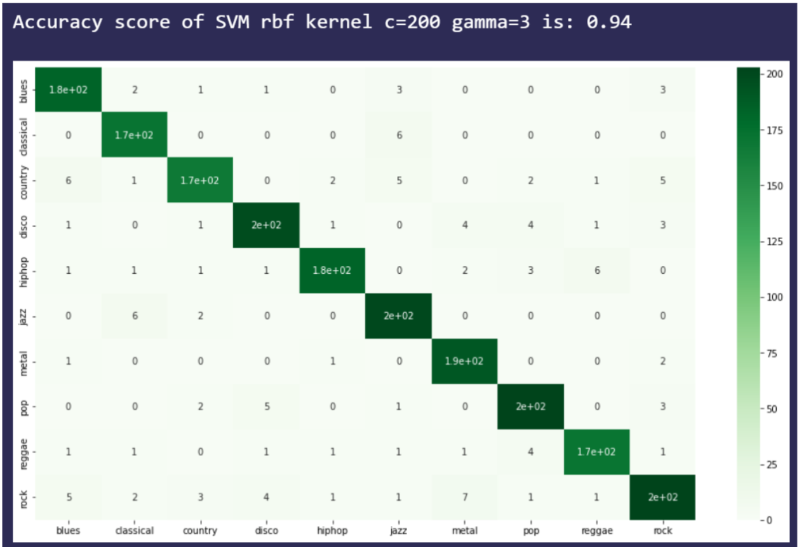

**Heatmap of the confusion matrix of the predictions of the XGBoost model**

  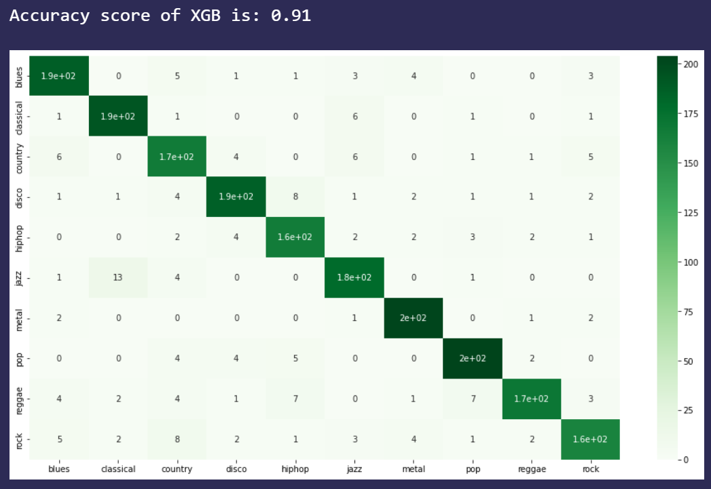

**Plot of loss, accuracy, validation loss and validation accuracy**

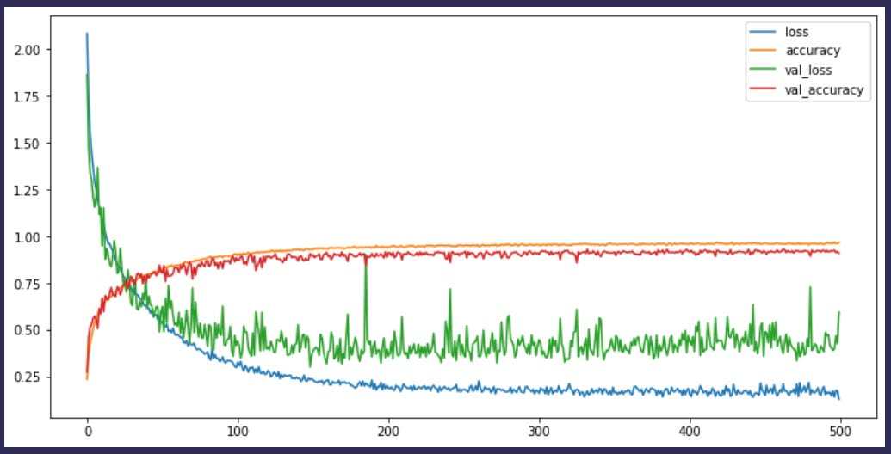

## Results and Analysis

The results show that three classifiers outperformed others and have accuracy above 90% - the classifiers being Support Vector Machine Classifier, Convolutional Neural Network and XGBoost Classifier. Furthermore, the best performing model was the Support Vector Machine Classifier (SVC) after hyperparameter tuning with the parameters being C=200, gamma=3, degree=3, kernel='rbf', cache_size=200. The highest Accuracy achieved was 94%.

## Extras

A Recommender System was implemented. It finds similar songs to a given audio file and ranks them based on cosine similarity. Hence, on inputting an audio file, we would get the top 5 similar songs ranked from most similar to least similar.

## References

- https://www.ibm.com/topics/knn
- https://www.sciencedirect.com/topics/computer-science/decision-tree-classifier
- https://towardsdatascience.com/how-is-logistic-regression-used-as-a-classification-algorithm-51eaf0d01a78
- https://scikit-learn.org/stable/modules